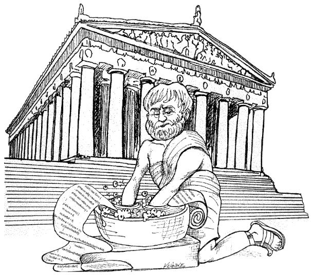

  

# کد تمیز (Clean Code)

شما این کتاب را به دو دلیل می‌خوانید. اول، چون برنامه‌نویس هستید. دوم، چون می‌خواهید برنامه‌نویس بهتری شوید. خوب است. ما به برنامه‌نویسان بهتر نیاز داریم.
فصل ۱: کد تمیز

این کتاب درباره برنامه‌نویسی خوب است. پر است از کد. ما قرار است کد را از همه زوایا بررسی کنیم. از بالا به آن نگاه کنیم، از پایین به آن بنگریم، و از داخل به بیرونش ببینیم. وقتی کارمان تمام شد، درباره کد خیلی چیزها خواهیم دانست. علاوه بر این، توانایی تشخیص کد خوب از کد بد را خواهیم داشت. خواهیم دانست چگونه کد خوب بنویسیم و چگونه کد بد را به کد خوب تبدیل کنیم.
کد خواهد بود

ممکن است عده‌ای بگویند کتابی درباره کد کمی قدیمی است — که کد دیگر مسئله نیست و باید به مدل‌ها و نیازمندی‌ها توجه کنیم. برخی حتی ادعا کرده‌اند که دوران کد رو به پایان است، و به زودی همه کدها به صورت خودکار تولید می‌شوند و برنامه‌نویسان دیگر لازم نخواهند بود، چون کسب‌وکارها برنامه‌ها را مستقیماً از روی مشخصات می‌سازند.

این حرف‌ها بی‌معنی است! کد هرگز از بین نخواهد رفت، چون کد نمایانگر جزئیات نیازمندی‌هاست. در سطحی مشخص، این جزئیات نمی‌توانند نادیده گرفته شوند یا انتزاعی شوند؛ باید دقیقاً مشخص شوند. و مشخص کردن نیازمندی‌ها به اندازه‌ای دقیق که یک ماشین بتواند آن‌ها را اجرا کند، همان برنامه‌نویسی است. چنین مشخصاتی همان کد هستند.

من انتظار دارم سطح انتزاع زبان‌های ما افزایش یابد و همچنین تعداد زبان‌های domain-specific (زبان‌های تخصصی حوزه) افزایش یابد که این موضوع اتفاق خوبی است. اما این موضوع کد را حذف نخواهد کرد. در واقع، تمام مشخصاتی که در این زبان‌های سطح بالا و domain-specific نوشته می‌شوند، کد هستند! این کدها باید دقیق، درست و به حدی رسمی و مفصل باشند که یک ماشین بتواند آن‌ها را بفهمد و اجرا کند.

کسانی که فکر می‌کنند روزی کد حذف خواهد شد، مثل ریاضیدانانی هستند که آرزو دارند ریاضیات روزی بدون فرم رسمی باشد. آن‌ها امید دارند روزی ماشین‌هایی خلق شوند که کاری را که ما می‌خواهیم انجام دهند نه کاری که می‌گوییم. این ماشین‌ها باید ما را آنقدر خوب بفهمند که نیازهای مبهم ما را به برنامه‌های کاملاً دقیق و اجرایی تبدیل کنند.

این هرگز اتفاق نخواهد افتاد. حتی انسان‌ها با همه شهود و خلاقیتشان هم نتوانسته‌اند سیستم‌های موفق را از احساسات مبهم مشتریان خلق کنند. اگر رشته مشخص‌کردن نیازمندی‌ها به ما چیزی آموخته باشد، این است که نیازمندی‌های خوب و دقیق به اندازه کد رسمی هستند و می‌توانند به عنوان تست‌های اجرایی کد عمل کنند!

بخاطر بسپارید که کد در نهایت زبانی است که ما در آن نیازمندی‌ها را بیان می‌کنیم. ممکن است زبان‌هایی بسازیم که به نیازمندی‌ها نزدیک‌تر باشند. ممکن است ابزارهایی بسازیم که به ما کمک کنند آن نیازمندی‌ها را به ساختارهای رسمی تبدیل کنیم. اما هرگز نمی‌توانیم دقت لازم را حذف کنیم — پس همیشه کد وجود خواهد داشت.
کد بد (Bad Code)

من اخیراً پیشگفتار کتاب Kent Beck با عنوان Implementation Patterns را می‌خواندم. او می‌گوید: "این کتاب بر یک فرضیه نسبتاً شکننده بنا شده: اینکه کد خوب اهمیت دارد..." فرضیه شکننده؟ من مخالفم! فکر می‌کنم این فرضیه یکی از مستحکم‌ترین و پشتیبانی شده‌ترین فرضیه‌ها در حرفه ماست (و فکر می‌کنم کنت هم این را می‌داند). ما می‌دانیم کد خوب مهم است چون مدت‌ها با نبود آن دست و پنجه نرم کرده‌ایم.

شرکتی را می‌شناسم که در اواخر دهه ۸۰ یک برنامه بسیار محبوب نوشت. این برنامه مورد استقبال حرفه‌ای‌ها قرار گرفت. اما بعد چرخه‌های انتشار طولانی شدند، باگ‌ها اصلاح نشدند، زمان بارگذاری افزایش یافت و کرش‌ها بیشتر شدند. روزی که از سر ناامیدی برنامه را کنار گذاشتم و دیگر هرگز استفاده نکردم، به یاد دارم. آن شرکت پس از مدتی ورشکست شد.

دو دهه بعد با یکی از کارمندان اولیه آن شرکت صحبت کردم و از او پرسیدم چه اتفاقی افتاده. پاسخ او ترس من را تایید کرد: آن‌ها محصول را با عجله به بازار فرستادند و کد را به هم ریختند. با اضافه شدن ویژگی‌های بیشتر، کد بدتر شد و در نهایت دیگر نتوانستند آن را مدیریت کنند. کد بد همان چیزی بود که شرکت را نابود کرد.
آیا تا به حال کد بد شما را به طور جدی مختل کرده؟

اگر برنامه‌نویس با تجربه‌ای باشید، بارها این مشکل را احساس کرده‌اید. ما برای آن اسم هم داریم: wading — یعنی دست و پا زدن در کد بد. ما در میان شاخه‌های درهم و دام‌های پنهان گام برمی‌داریم و به دنبال سرنخی از آنچه رخ می‌دهد هستیم، اما چیزی جز کد بی‌معنی بیشتر نمی‌بینیم.

البته که کد بد مانع شده. پس چرا خودتان آن را نوشتید؟ می‌خواستید سریع باشید؟ عجله داشتید؟ احتمالاً همینطور بوده. شاید فکر می‌کردید وقت ندارید کار خوب انجام دهید؛ شاید می‌ترسید اگر وقت صرف تمیز کردن کد کنید، مدیرتان ناراضی شود. شاید از کار روی برنامه خسته شده بودید و می‌خواستید زودتر تمام شود. یا شاید پشت سر هم وظایف دیگر داشتید که باید انجام می‌دادید و مجبور شدید این بخش را سریع جمع کنید تا به بعد برسید. همه ما این کارها را کرده‌ایم.

همه ما به همهمه‌ای که به وجود آوردیم نگاه کردیم و تصمیم گرفتیم آن را به بعد موکول کنیم. همه ما حس آرامش دیدن برنامه‌ای که کار می‌کند ولی شلخته است را تجربه کرده‌ایم و گفته‌ایم بعداً آن را تمیز می‌کنیم. البته در آن زمان قانون LeBlanc را نمی‌دانستیم: «بعداً» یعنی هیچ‌وقت.
هزینه کل مالکیت یک به‌هم‌ریختگی

اگر بیش از دو یا سه سال برنامه‌نویس بوده‌اید، احتمالاً به خاطر کد شلوغ دیگران کند شده‌اید. اگر بیشتر از این مدت برنامه‌نویس بوده‌اید، قطعاً این اتفاق افتاده. میزان کندی می‌تواند بسیار زیاد باشد. در طی یک یا دو سال، تیم‌هایی که در ابتدا بسیار سریع کار می‌کردند، ممکن است به سرعت حلزون برسند. هر تغییری در کد، دو یا سه بخش دیگر را خراب می‌کند. هیچ تغییری ساده نیست. هر اضافه یا اصلاح در سیستم نیازمند این است که درهم‌ریختگی‌ها، پیچیدگی‌ها و گره‌ها فهمیده شوند تا بتوان گره‌ها و پیچیدگی‌های بیشتری اضافه کرد.

با گذشت زمان، آشفتگی آنقدر بزرگ، عمیق و پیچیده می‌شود که دیگر نمی‌توان آن را تمیز کرد. هیچ راهی وجود ندارد.

وقتی آشفتگی بیشتر می‌شود، بهره‌وری تیم کاهش می‌یابد و به صفر نزدیک می‌شود. وقتی بهره‌وری کم می‌شود، مدیریت تنها کاری که می‌تواند انجام دهد این است که افراد بیشتری به پروژه اضافه کند تا بهره‌وری را افزایش دهد. اما آن افراد جدید با طراحی سیستم آشنا نیستند. تفاوت بین تغییری که با هدف طراحی همخوانی دارد و تغییری که آن را خراب می‌کند را نمی‌دانند. علاوه بر این، همه تحت فشار زیادی هستند تا بهره‌وری را افزایش دهند، بنابراین همه بیشتر و بیشتر آشفتگی ایجاد می‌کنند و بهره‌وری را بیشتر به صفر نزدیک می‌کنند.

(نگاه کنید به شکل ۱-۱)
بازطراحی بزرگ در آسمان

سرانجام تیم شورش می‌کند و به مدیریت اطلاع می‌دهد که دیگر نمی‌توانند در این کد نفرت‌انگیز توسعه دهند و خواستار بازطراحی می‌شوند. مدیریت نمی‌خواهد منابع برای بازطراحی صرف کند اما نمی‌تواند بهره‌وری افتضاح را انکار کند. در نهایت با درخواست توسعه‌دهندگان موافقت می‌کند و بازطراحی بزرگ را مجاز می‌داند.

یک تیم ویژه (tiger team) تشکیل می‌شود. همه می‌خواهند در این تیم باشند چون پروژه‌ای جدید و تمیز است. فقط بهترین و باهوش‌ترین‌ها انتخاب می‌شوند و بقیه باید به نگهداری سیستم فعلی ادامه دهند.

حالا دو تیم در مسابقه‌ای هستند. تیم ویژه باید سیستمی بسازد که همه امکانات سیستم قدیمی را داشته باشد و همزمان تغییرات سیستم قدیمی را دنبال کند. مدیریت سیستم قدیمی را تا زمانی که سیستم جدید کامل نباشد جایگزین نمی‌کند.

این رقابت می‌تواند سال‌ها طول بکشد. من دیده‌ام که ده سال طول کشیده. وقتی تمام شود، اعضای اولیه تیم ویژه رفته‌اند و اعضای جدید خواستار بازطراحی سیستم جدید هستند چون آن هم به هم ریخته است.

اگر حتی کمی از این داستان را تجربه کرده‌اید، می‌دانید صرف وقت برای تمیز نگه داشتن کد نه تنها به‌صرفه است بلکه برای بقا در حرفه لازم است.
نگرش

آیا تا به حال مجبور شده‌اید هفته‌ها برای کاری وقت بگذارید که باید چند ساعت طول می‌کشید؟ آیا دیده‌اید تغییری که باید یک خط باشد در صدها ماژول مختلف اعمال شده باشد؟ این مشکلات بسیار رایج است.

چرا این اتفاق برای کد می‌افتد؟ چرا کد خوب به سرعت به کد بد تبدیل می‌شود؟ توضیحات زیادی وجود دارد. می‌گوییم نیازمندی‌ها تغییر کرده‌اند و طراحی را خراب کرده‌اند. می‌گوییم برنامه‌ریزی‌ها خیلی فشرده بودند. درباره مدیران بی‌کفایت و مشتریان سخت‌گیر و بخش بازاریابی بی‌فایده غر می‌زنیم. اما مشکل، دیربرت عزیز، در ماست نه در ستارگان.

ما غیرحرفه‌ای هستیم.

شاید تلخ باشد، اما چگونه ممکن است این آشفتگی تقصیر ما باشد؟ نیازمندی‌ها چه؟ برنامه زمانی چه؟ مدیران و بازاریابی چه؟ آن‌ها مقصر نیستند؟

نه. مدیران و بازاریاب‌ها به ما نگاه می‌کنند تا اطلاعات لازم برای دادن وعده‌ها و تعهدات را بگیرند؛ حتی وقتی به ما نگاه نمی‌کنند، نباید خجالت بکشیم که نظراتمان را بگوییم. کاربران به ما نگاه می‌کنند تا تایید کنیم نیازمندی‌ها چگونه در سیستم جا می‌گیرند. مدیران پروژه به ما نگاه می‌کنند تا به برنامه زمانی کمک کنیم. ما در برنامه‌ریزی پروژه مشارکت داریم و مسئولیت زیادی در شکست‌ها داریم؛ به ویژه اگر آن شکست‌ها به خاطر کد بد باشد.

اما شما می‌گویید: «اگر حرف مدیرم را نزنم، اخراج می‌شوم.» احتمالاً نه. بیشتر مدیران حقیقت را می‌خواهند حتی اگر طوری رفتار نکنند. بیشتر مدیران کد خوب می‌خواهند حتی اگر روی برنامه زمانی وسواس داشته باشند. آن‌ها ممکن است به شدت از برنامه زمانی و نیازمندی‌ها دفاع کنند؛ اما این وظیفه آن‌هاست. وظیفه شماست که با همان شدت از کد دفاع کنید.

فرض کنید پزشک هستید و بیمار از شما می‌خواهد به خاطر صرفه‌جویی در وقت، دیگر دستانتان را پیش از جراحی نشویید. بیمار رئیس است اما پزشک باید قاطعانه مخالفت کند. چرا؟ چون پزشک بهتر از بیمار خطر عفونت و بیماری را می‌داند. رعایت نکردن این موضوع غیرحرفه‌ای و حتی جنایت است.

برنامه‌نویسان هم باید همین‌طور باشند و نباید تسلیم خواسته مدیرانی شوند که خطر ایجاد آشفتگی را درک نمی‌کنند.

# معمای اصلی (The Primal Conundrum)

برنامه‌نویسان با یک معمای اساسی در ارزش‌ها روبرو هستند. همه‌ی توسعه‌دهندگانی که چند سال تجربه دارند می‌دانند که آشفتگی‌های قبلی سرعت‌شان را کم می‌کند. اما با این وجود، همه‌ی توسعه‌دهندگان تحت فشار هستند تا برای رسیدن به موعد تحویل، کدهای نامرتب تولید کنند. خلاصه اینکه، آنها وقت کافی برای تمیز نوشتن کد صرف نمی‌کنند تا سریع‌تر پیش بروند!

حرفه‌ای‌های واقعی می‌دانند که بخش دوم این معما اشتباه است. شما با نوشتن کد نامرتب، موعد تحویل را نمی‌گیرید. در واقع، همین آشفتگی بلافاصله شما را کند می‌کند و باعث می‌شود موعد تحویل را از دست بدهید. تنها راه رسیدن به موعد تحویل — و تنها راه رفتن با سرعت — این است که همیشه کد را تا حد ممکن تمیز نگه دارید.
هنر نوشتن کد تمیز؟

فرض کنیم شما قبول دارید که کد نامرتب مانع بزرگی است. فرض کنیم می‌پذیرید تنها راه سریع بودن، نگه داشتن کد در وضعیت تمیز است. پس باید از خودتان بپرسید: «چطور کد تمیز می‌نویسم؟» اگر ندانید کد تمیز یعنی چه، تلاش برای نوشتن کد تمیز بی‌فایده است!

خبر بد این است که نوشتن کد تمیز شبیه نقاشی کردن است. بیشتر ما می‌دانیم یک نقاشی خوب چطور است و نقاشی بد چگونه است. اما تشخیص هنر خوب به معنای این نیست که بتوانیم خوب نقاشی کنیم. دقیقاً به همین شکل، توانایی تشخیص کد تمیز از کد کثیف به معنای توانایی نوشتن کد تمیز نیست!

نوشتن کد تمیز نیازمند استفاده‌ی منظم و دقیق از تکنیک‌های کوچک فراوان است که با حس «تمیزی» به دست می‌آید. این «حس کد» کلید اصلی است.
بعضی‌ها به صورت ذاتی این حس را دارند، بعضی‌ها باید برای کسب آن مبارزه کنند. این حس نه تنها به ما می‌گوید کد خوب یا بد است، بلکه راهبرد تبدیل کد بد به کد تمیز را هم نشان می‌دهد.

یک برنامه‌نویس بدون «حس کد» ممکن است یک ماژول نامرتب را ببینید و به آشفتگی آن پی ببرد، اما نداند چطور آن را اصلاح کند. اما یک برنامه‌نویس با «حس کد» گزینه‌ها و راهکارهای مختلف را می‌بیند. این حس به او کمک می‌کند بهترین راه حل را انتخاب کرده و یک سری تغییرات پایدار و حفظ‌کننده رفتار را برای بهبود کد انجام دهد.

خلاصه اینکه، برنامه‌نویسی که کد تمیز می‌نویسد، هنرمندی است که می‌تواند صفحه‌ی خالی را طی چند مرحله به سیستمی زیبا و مرتب تبدیل کند.
کد تمیز چیست؟

احتمالاً به تعداد برنامه‌نویسان، تعاریف مختلفی از کد تمیز وجود دارد. برای همین از چند برنامه‌نویس شناخته شده و با تجربه پرسیدم نظرشان چیست:

بیارنه استراستروپ (خالق ++C و نویسنده کتاب The C++ Programming Language):
«کد من باید زیبا و کارآمد باشد. منطق کد باید مستقیم باشد تا جای خطا و باگ کم باشد، وابستگی‌ها حداقل باشند تا نگهداری آسان شود، مدیریت خطا باید کامل و مطابق یک استراتژی مشخص باشد، و عملکرد بهینه باشد تا کسی وسوسه نشود برای بهبود کد به روش‌های ناپخته دست بزند. کد تمیز یک کار را به خوبی انجام می‌دهد.»

بیارنه از واژه‌ی «زیبا» استفاده کرده، که خیلی معنی مهمی دارد. لغت‌نامه می‌گوید «زیبا» یعنی ظریف، ساده و خوشایند بودن. یعنی کد تمیز باید خواندنش خوشایند باشد، مثل یک جعبه موسیقی خوش‌ساخت یا یک ماشین خوش‌طراحی.
او همچنین روی «کارآمدی» تأکید کرده — شاید چون خالق C++ است — ولی به نظر من این بیشتر از فقط سرعت است. چرخه‌های تلف‌شده یعنی ناپختگی و زشتی. و بیارنه می‌گوید بد کد «وسوسه» می‌کند که آشفتگی بیشتر شود، چون وقتی دیگران کد بد را تغییر می‌دهند، معمولاً اوضاع را بدتر می‌کنند.

دیو توماس و اندی هانت (نویسندگان Pragmatic Programmer):
آنها با استعاره «پنجره‌های شکسته» به این موضوع اشاره کرده‌اند: ساختمانی که پنجره‌هایش شکسته باشد، به نظر می‌رسد کسی به آن اهمیت نمی‌دهد. پس دیگران هم اهمیتی نمی‌دهند و پنجره‌های بیشتری را می‌شکنند و خرابکاری و آشفتگی بیشتر می‌شود. یک پنجره شکسته شروع روند فروپاشی است.

بیارنه همچنین روی «مدیریت کامل خطا» تأکید دارد که نشان‌دهنده دقت به جزئیات است. خطاهای کوتاه شده، نشت حافظه، شرایط رقابتی (race conditions) و نام‌گذاری‌های ناسازگار نمونه‌هایی از بی‌دقتی هستند. در نهایت، کد تمیز به جزئیات اهمیت زیادی می‌دهد.

او در نهایت می‌گوید کد تمیز «یک کار را خوب انجام می‌دهد» — این اصل در بسیاری از اصول طراحی نرم‌افزار دیده می‌شود. کد بد معمولاً می‌خواهد چند کار را همزمان انجام دهد و ابهام دارد؛ اما کد تمیز متمرکز و واضح است.

گرِیدی بوچ (نویسنده Object Oriented Analysis and Design with Applications):
«کد تمیز ساده و مستقیم است. کد تمیز مثل متن نثر خوب نوشته شده می‌خواند. کد تمیز هیچگاه نیت طراح را پنهان نمی‌کند بلکه پر از انتزاعات شفاف و خطوط کنترل واضح است.»

گرِیدی از زاویه خوانایی به موضوع نگاه می‌کند. من دیدگاه او را خیلی دوست دارم که می‌گوید کد تمیز باید مثل نثر خوب خوانده شود.
به یاد بیاورید وقتی یک کتاب خیلی خوب خوانده‌اید چطور کلمات به تصاویر تبدیل می‌شدند، مثل تماشای فیلم، حتی بهتر. شخصیت‌ها را می‌دیدید، صداها را می‌شنیدید، احساسات و طنز را درک می‌کردید.

خواندن کد تمیز شاید هیچ‌وقت مثل خواندن کتاب‌های داستان جذاب نباشد، اما این تشبیه خیلی هم بد نیست. مثل یک رمان خوب، کد تمیز باید کشمکش‌ها و پیچیدگی‌های مسئله را آشکار کند، به اوج برساند و بعد راه حل واضحی را به خواننده نشان دهد که باعث شود بگوید «آها! البته!»

اصطلاح «انتزاع شفاف (crisp abstraction)» که گریدی استفاده می‌کند، ترکیبی از دو کلمه متضاد است: «شفاف» یعنی دقیق و بدون ابهام، و «انتزاع» یعنی کلی‌گویی. معنی عمیق این است که کد باید واضح و دقیق باشد، فقط آنچه لازم است را داشته باشد، و خواننده باید تصور کند که نویسنده تصمیم‌گیرنده بوده است.

دیو «بزرگ» توماس (مؤسس OTI و از پایه‌گذاران استراتژی Eclipse):
«کد تمیز باید قابل خواندن و بهبود توسط برنامه‌نویسان دیگر باشد، نه فقط نویسنده اصلی. باید دارای تست‌های واحد (unit) و پذیرش (acceptance) باشد. باید نام‌های معنادار داشته باشد. باید یک راه مشخص برای انجام یک کار داشته باشد، نه چند راه مختلف. وابستگی‌های کد باید حداقل و به‌روشنی تعریف شده باشند و API شفاف و کوچک ارائه دهد. کد باید ادبی (literate) باشد، زیرا بسته به زبان برنامه‌نویسی، همه اطلاعات لازم را نمی‌توان فقط در کد بیان کرد.»

دیو هم مثل گریدی به خوانایی اهمیت می‌دهد اما نکته مهمی اضافه می‌کند: کد باید طوری نوشته شود که دیگران بتوانند آن را بهبود دهند، نه فقط بخوانند.
او کد تمیز را به تست‌ها گره می‌زند. ده سال پیش این حرف شاید تعجب‌آور بود، اما حالا توسعه مبتنی بر تست (TDD) تاثیر عمیقی روی صنعت داشته است. دیو می‌گوید بدون تست، کد تمیز نیست، حتی اگر چقدر هم زیبا و خوانا باشد.

او دوبار روی کلمه «حداقل (minimal)» تأکید می‌کند و کوچک بودن کد را مهم می‌داند. این نکته از ابتدای تاریخ ادبیات نرم‌افزار همیشه مطرح بوده: کوچکتر بهتر است.

او همچنین اشاره‌ای نرم به برنامه‌نویسی ادبی (literate programming) دونالد کنوت دارد. نکته اصلی این است که کد باید به شکلی نوشته شود که برای انسان‌ها قابل فهم‌تر باشد، نه فقط ماشین‌ها.

مایکل فدرز، نویسنده‌ی کتاب «کار کردن موثر با کد قدیمی»
من می‌توانستم همه ویژگی‌هایی که در کد تمیز می‌بینم را فهرست کنم، اما یک ویژگی کلی هست که همه آن‌ها را به هم مرتبط می‌کند. کد تمیز همیشه طوری به نظر می‌رسد که انگار توسط کسی نوشته شده که به آن اهمیت می‌دهد. هیچ کاری واضح و مشخص نیست که بتوانید برای بهتر کردنش انجام دهید. همه این موارد توسط نویسنده کد در نظر گرفته شده‌اند، و اگر بخواهید به فکر بهبود بیفتید، دوباره به همان جایی می‌رسید که هستید، جایی که دارید قدردان کدی می‌شوید که کسی برای شما گذاشته — کدی که توسط کسی نوشته شده که عمیقاً به این هنر اهمیت می‌دهد.
یک کلمه: توجه (care).
این واقعاً موضوع این کتاب است. شاید یک زیرعنوان مناسب می‌تواند «چگونه به کد اهمیت بدهیم» باشد.

مایکل دقیقا به هدف زده است. کد تمیز یعنی کدی که مراقبت شده است. کسی وقت گذاشته تا آن را ساده و مرتب نگه دارد. به جزئیات با دقت توجه کرده است. به آن اهمیت داده است.

ران جفریز، نویسنده‌ی «برنامه‌نویسی اکستریم نصب شده» و «ماجراهای برنامه‌نویسی اکستریم در C#»
ران حرفه‌ی خود را با برنامه‌نویسی به زبان فورترن در ستاد فرماندهی استراتژیک آغاز کرد و تقریباً به همه زبان‌ها و روی تقریباً همه ماشین‌ها کد نوشته است. خوب است کلماتش را با دقت بشنویم.
در سال‌های اخیر، من شروع می‌کنم و تقریباً همه کارهایم را با قوانین بک برای کد ساده انجام می‌دهم. به ترتیب اولویت، کد ساده:

    همه تست‌ها را اجرا می‌کند؛

    هیچ تکراری ندارد؛

    همه ایده‌های طراحی سیستم را بیان می‌کند؛

    تعداد موجودیت‌ها مثل کلاس‌ها، متدها، توابع و غیره را به حداقل می‌رساند.

از همه این‌ها، من بیشتر روی تکرار تمرکز می‌کنم. وقتی یک چیز بارها و بارها انجام می‌شود، یعنی ایده‌ای در ذهن ما هست که به درستی در کد بیان نشده. سعی می‌کنم بفهمم آن ایده چیست. سپس سعی می‌کنم آن ایده را واضح‌تر بیان کنم.

بیان‌گرایی برای من شامل نام‌های معنادار است و معمولاً نام چیزها را چند بار تغییر می‌دهم تا به نامی که مناسب است برسم. با ابزارهای مدرن مثل Eclipse، تغییر نام هزینه چندانی ندارد، پس تغییر نام برایم مشکلی ایجاد نمی‌کند.
اما بیان‌گرایی فقط به نام‌ها محدود نمی‌شود. من همچنین نگاه می‌کنم که آیا یک شیء یا متد بیش از یک کار انجام می‌دهد یا نه. اگر یک شیء است، احتمالاً باید به دو یا چند شیء شکسته شود. اگر یک متد است، همیشه از روش بازآرایی استخراج متد استفاده می‌کنم، که در نتیجه یک متد داریم که دقیق‌تر می‌گوید چه کاری انجام می‌دهد، و چند زیرمتد که نحوه انجام آن را بیان می‌کنند.

کاهش تکرار و بیان‌گرایی من را تا حد زیادی به سمت کد تمیز می‌برد، و بهبود کدهای کثیف با در نظر گرفتن همین دو مورد می‌تواند تفاوت بزرگی ایجاد کند.
اما یک چیز دیگر هم هست که انجام می‌دهم و توضیح دادنش کمی سخت‌تر است.

بعد از سال‌ها انجام این کار، به نظرم همه برنامه‌ها از عناصر خیلی مشابهی ساخته شده‌اند. یک نمونه این است که «چیزها را در یک مجموعه پیدا کنیم.»
چه پایگاه داده‌ای از سوابق کارکنان داشته باشیم، یا یک هَش مپ از کلید و مقدار، یا آرایه‌ای از آیتم‌ها، اغلب می‌خواهیم مورد خاصی از آن مجموعه را پیدا کنیم. وقتی این اتفاق می‌افتد، معمولاً پیاده‌سازی خاص را در یک متد یا کلاس انتزاعی‌تر می‌پیچانم. این به من چند مزیت جالب می‌دهد:

می‌توانم حالا با چیزی ساده مثل هَش مپ پیاده‌سازی کنم، ولی چون همه ارجاعات به این جستجو با انتزاع من پوشش داده شده، می‌توانم هر زمان بخواهم پیاده‌سازی را تغییر دهم. می‌توانم سریع پیش بروم در حالی که قابلیت تغییر در آینده را حفظ می‌کنم.

علاوه بر این، انتزاع مجموعه معمولاً توجه من را به آنچه واقعاً اتفاق می‌افتد جلب می‌کند و مانع می‌شود که به سمت پیاده‌سازی رفتارهای پیچیده و دلخواه مجموعه بروم، در حالی که فقط به چند روش ساده برای پیدا کردن نیاز دارم.

کاهش تکرار، بیان‌گرایی بالا، و ساخت زودهنگام انتزاع‌های ساده. این‌ها برای من کد تمیز را می‌سازند.

وارد کانینگهام، مخترع ویکی و از پیشگامان برنامه‌نویسی اکستریم
وقتی روی کد تمیز کار می‌کنی، می‌دانی که هر تابعی که می‌خوانی تقریباً همان چیزی است که انتظار داشتی. وقتی کد به حدی زیبا باشد که انگار زبان برنامه‌نویسی مخصوص حل آن مشکل ساخته شده است، می‌توانی به آن کد زیبا بگویی.

جملاتی مثل این، نشان‌دهنده‌ی سبک تفکر وارد هستند. می‌خوانی، سرت را تکان می‌دهی و می‌روی سراغ موضوع بعدی. این جملات خیلی منطقی و واضح به نظر می‌رسند، به قدری که به نظر چیز عمیقی نمی‌آیند. شاید فکر کنی همان چیزی است که انتظارش را داشتی. اما بیایید دقیق‌تر نگاه کنیم.

«... تقریباً همان چیزی که انتظار داشتی.»
آخرین بار کی دیدی یک ماژول تقریباً همان چیزی باشد که انتظار داشتی؟
آیا بیشتر ماژول‌هایی که می‌بینی پیچیده، سردرگم‌کننده و درهم نیستند؟
آیا معمولاً نباید مدام تلاش کنی تا نخ‌های منطق را در میان کد درهم و برهم دنبال کنی؟
آخرین بار کی بود که کدی خواندی و مثل اینکه به حرف وارد سر تکان دادی؟

وارد انتظار دارد که وقتی کد تمیز می‌خوانی، اصلاً غافلگیر نشوی. حتی تلاش زیادی هم نکنی. کد را می‌خوانی و دقیقاً همان چیزی است که انتظار داشتی. واضح، ساده و قانع‌کننده است. هر ماژول زمینه را برای بعدی آماده می‌کند. هر ماژول به تو می‌گوید که ماژول بعدی چگونه نوشته می‌شود. برنامه‌هایی که این‌قدر تمیزند آن‌قدر خوب نوشته شده‌اند که اصلاً متوجهش نمی‌شوی. طراح آن‌ها را آن‌قدر ساده کرده که انگار طراحی فوق‌العاده‌ای هستند.

و درباره‌ی مفهوم زیبایی وارد چه؟
ما همه شکایت داشتیم که زبان‌های ما برای مشکلات ما ساخته نشده‌اند. اما جمله وارد مسئولیت را دوباره به ما باز می‌گرداند.
او می‌گوید کد زیبا زبان را طوری نشان می‌دهد که انگار مخصوص حل مشکل ساخته شده! پس این وظیفه‌ی ماست که زبان را ساده جلوه دهیم!
این زبان نیست که برنامه‌ها را ساده نشان می‌دهد، برنامه‌نویس است که زبان را ساده نشان می‌دهد!
مدرسه‌های فکری

من (عمو باب) چه فکر می‌کنم؟
این کتاب به طور مفصل و دقیق به تو می‌گوید که من و همفکرانم درباره کد تمیز چه فکر می‌کنیم.
ما به تو خواهیم گفت چه چیزی یک نام متغیر تمیز است، یک تابع تمیز، یک کلاس تمیز و غیره. این نظرات را به عنوان مطلق می‌گوییم و بابت قاطع بودن‌مان عذرخواهی نمی‌کنیم.
برای ما، در این مرحله از حرفه‌مان، این‌ها حقیقت‌اند. این‌ها مکتب فکری ما درباره کد تمیز است.

مانند هنرهای رزمی، همه روی بهترین هنر رزمی یا بهترین تکنیک آن توافق ندارند. استادان هنرهای رزمی معمولاً مکتب خودشان را دارند و شاگردان‌شان را جذب می‌کنند. مثلاً جوجیتسوی گرسی در برزیل، یا جوجیتسوی هاكوریو در توکیو، یا جیت کون دو به وسیله بروس لی در آمریکا.
شاگردان این مکتب‌ها تمام وجودشان را وقف یادگیری تعالیم آن استاد می‌کنند و ممکن است بعدها شاگرد استاد دیگری شوند تا دانش‌شان را گسترش دهند. برخی هم در نهایت خودشان مکتب جدیدی بنا می‌کنند.

هیچ کدام از این مکتب‌ها به طور مطلق درست نیستند، اما در هر مکتب، آن تعالیم درست فرض می‌شوند.
پس این کتاب را توصیف مکتب «منتور شیپ» در کد تمیز بدان. تکنیک‌ها و تعالیم آن، روش ما برای تمرین این هنر است. ما ادعا می‌کنیم اگر این تعالیم را دنبال کنی، از فواید آن بهره‌مند می‌شوی و یاد می‌گیری کد تمیز و حرفه‌ای بنویسی. اما اشتباه نکن که فکر کنی ما به طور مطلق «درست» هستیم. مکتب‌ها و استادان دیگر هم به همان اندازه حرفه‌ای هستند. بهتر است از آن‌ها هم یاد بگیری.
ما نویسنده‌ایم

قسمت @author در مستندات کد نشان می‌دهد که ما نویسنده هستیم.
و نویسندگان مسئول خوب ارتباط برقرار کردن با خوانندگانشان هستند.
دفعه بعد که کدی نوشتی، یادت باشد که داری برای خوانندگانی می‌نویسی که تلاش تو را ارزیابی می‌کنند.

ممکن است بپرسی: چقدر کد واقعاً خوانده می‌شود؟ بیشتر وقت صرف نوشتن نمی‌شود؟
آیا تا به حال ضبط و پخش مجدد یک جلسه ویرایش کد را انجام داده‌ای؟
در دهه ۸۰ و ۹۰، ویرایشگرهایی مثل Emacs همه ضربه‌های کلید را ضبط می‌کردند و می‌شد یک ساعت کار را به صورت یک فیلم پرسرعت بازپخش کرد. وقتی من این کار را کردم، نتایج جالب بود:
بیشتر زمان بازپخش صرف اسکرول کردن و جستجو در ماژول‌های دیگر می‌شد!
کدی که نوشتی پاک می‌کردی و دوباره می‌نوشتی!
کد دیگری را چک می‌کردی که چگونه فراخوانی شده است!
و این روند ادامه داشت...

نسبت زمان خواندن به نوشتن بیش از ۱۰ به ۱ است!
ما دائماً کد قدیمی را می‌خوانیم تا بتوانیم کد جدید بنویسیم.
پس باید خواندن کد آسان باشد، حتی اگر نوشتن را کمی سخت‌تر کند.
بدون این، نمی‌توانی کدی بنویسی چون نمی‌توانی کد اطرافش را بخوانی.
قانون پیشاهنگ

کافی نیست که فقط کد را خوب بنویسیم، باید آن را تمیز نگه داریم. همه ما دیده‌ایم که کد با گذشت زمان پوسیده و خراب می‌شود. پس باید فعالانه جلوی این را بگیریم.
قانون پیشاهنگ‌ها می‌گوید: «کمپ را تمیزتر از وقتی که رسیدی ترک کن.»
اگر همه ما کد را وقتی تحویل می‌دهیم کمی تمیزتر از وقتی که گرفتیم باشد، کد نمی‌تواند خراب شود.
تمیزکاری لازم نیست بزرگ باشد: تغییر نام یک متغیر، شکستن یک تابع بزرگ، حذف یک تکرار کوچک، تمیز کردن یک عبارت شرطی پیچیده.
تصور کن پروژه‌ای که کدش با گذشت زمان بهتر و بهتر شود. آیا فکر می‌کنی گزینه‌ای بهتر از این وجود دارد؟ به راستی، بهبود مستمر بخشی ذاتی از حرفه‌ای بودن نیست؟
پیش‌زمینه و اصول

این کتاب به نوعی «پیش‌درآمد» کتاب دیگری است که در ۲۰۰۲ نوشتم به نام «توسعه نرم‌افزار چابک: اصول، الگوها و تمرین‌ها». آن کتاب درباره اصول طراحی شیءگرا و بسیاری از تمرین‌های برنامه‌نویسی حرفه‌ای است. اگر آن را نخوانده‌ای، این کتاب ادامه داستان آن است، اما در سطح کد.
نتیجه‌گیری

کتاب‌های هنری وعده نمی‌دهند که هنرمند بسازند، فقط ابزار و تکنیک‌هایی که هنرمندان استفاده می‌کنند را نشان می‌دهند.
این کتاب هم وعده نمی‌دهد که تو را برنامه‌نویس عالی کند، اما تکنیک‌ها و اصولی را که برنامه‌نویسان حرفه‌ای استفاده می‌کنند، به تو نشان می‌دهد.
برای حرفه‌ای شدن در برنامه‌نویسی، تمرین و ممارست لازم است.

کتاب‌شناسی
[Beck07]: الگوهای پیاده‌سازی، کنت بک، اَدیسون-وِسلی، ۲۰۰۷.
[Knuth92]: برنامه‌نویسی ادبی (Literate Programming)، دونالد ای. نات، مرکز مطالعه زبان و اطلاعات، دانشگاه استنفورد، ۱۹۹۲.