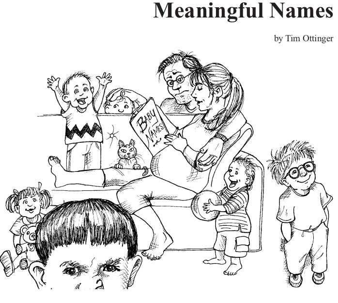

<p align="center">
  
</p>

## نام گذاری(Meaningful Names)

# مقدمه

نام‌گذاری همه‌جا در دنیای نرم‌افزار حضور دارد. ما به متغیرها، توابع، آرگومان‌ها، کلاس‌ها و پکیج‌ها اسم می‌دهیم. به فایل‌های منبع و پوشه‌هایی که آن‌ها را در خود نگه می‌دارند، اسم می‌دهیم. به فایل‌های jar، war و ear اسم می‌دهیم. ما مدام در حال نام‌گذاری هستیم. و چون این کار را زیاد انجام می‌دهیم، باید آن را به‌درستی انجام دهیم. آنچه در ادامه می‌آید، چند قانون ساده برای انتخاب نام‌های خوب است.
استفاده از نام‌هایی که هدف را آشکار می‌کنند

گفتن اینکه «اسم‌ها باید هدف را مشخص کنند» آسان است. چیزی که می‌خواهیم تأکید کنیم این است که ما در این موضوع جدی هستیم. انتخاب نام‌های خوب زمان‌بر است، اما در نهایت بیشتر از زمانی که صرف شده صرفه‌جویی می‌کند. پس در انتخاب نام‌ها دقت کنید و اگر نام بهتری پیدا کردید، آن را تغییر دهید. هر کسی که کد شما را می‌خواند (از جمله خودتان) خوشحال‌تر خواهد بود.

نام یک متغیر، تابع یا کلاس باید به پرسش‌های اساسی پاسخ دهد. باید مشخص کند که چرا وجود دارد، چه کاری انجام می‌دهد، و چگونه باید از آن استفاده کرد. اگر برای فهمیدن معنی یک اسم نیاز به کامنت باشد، پس آن اسم به‌درستی هدف را منتقل نکرده است.

int d; // زمان سپری‌شده بر حسب روز

اسم d هیچ اطلاعات مفیدی منتقل نمی‌کند. نه اشاره‌ای به زمان سپری‌شده دارد و نه به "روز". باید نامی انتخاب کنیم که هم واحد اندازه‌گیری و هم مفهوم آن را مشخص کند:

int elapsedTimeInDays;
int daysSinceCreation;
int daysSinceModification;
int fileAgeInDays;

استفاده از اسم‌هایی که هدف را نشان می‌دهند، فهم و تغییر کد را بسیار آسان‌تر می‌کند. به مثال زیر دقت کنید. هدف این کد چیست؟

public List<int[]> getThem() {
  List<int[]> list1 = new ArrayList<int[]>();
  for (int[] x : theList)
    if (x[0] == 4)
      list1.add(x);
  return list1;
}

چرا فهمیدن این کد سخت است؟ هیچ عبارت پیچیده‌ای در آن وجود ندارد. فاصله‌گذاری و تورفتگی هم مناسب است. فقط سه متغیر و دو مقدار ثابت در کد وجود دارند. حتی کلاس پیچیده یا متدهای چندریختی هم نیستند. فقط یک لیست از آرایه‌ها.

مشکل نه در سادگی کد بلکه در پنهان بودن معناست. یعنی اینکه با نگاه به کد نمی‌توان فهمید منظور چیست. این کد ما را وادار می‌کند به سؤالاتی مثل این فکر کنیم:

    چه چیزهایی داخل theList هستند؟

    معنی ایندکس صفر در آرایه چیست؟

    مقدار ۴ چه مفهومی دارد؟

    خروجی این تابع چطور قرار است استفاده شود؟

اما این اطلاعات می‌توانستند به‌راحتی از طریق نام‌گذاری درست منتقل شوند. فرض کنیم با یک بازی مین‌روب (Mine Sweeper) سروکار داریم و متوجه می‌شویم که theList در واقع برد بازی است که از سلول‌ها تشکیل شده. پس می‌توان آن را به gameBoard تغییر داد.

هر سلول در برد با یک آرایه ساده نمایش داده می‌شود. همچنین متوجه می‌شویم که ایندکس صفر، وضعیت سلول را نگه می‌دارد و مقدار ۴ به معنی "پرچم‌گذاری شده" (flagged) است. فقط با استفاده از این نام‌ها، می‌توانیم کد را به‌طرز قابل‌توجهی بهبود دهیم:

public List<int[]> getFlaggedCells() {
  List<int[]> flaggedCells = new ArrayList<int[]>();
  for (int[] cell : gameBoard)
    if (cell[STATUS_VALUE] == FLAGGED)
      flaggedCells.add(cell);
  return flaggedCells;
}

تعداد عملگرها و ثوابت تغییری نکرده، سطح تو رفتگی‌ها هم همان است. اما معنا و هدف کد به‌وضوح مشخص شده.

حتی می‌توانیم با تعریف یک کلاس برای سلول‌ها، به جای استفاده از آرایه‌ی اعداد صحیح (int[])، وضعیت را بهتر نشان دهیم. مثلاً متدی با نام isFlagged تعریف کنیم تا عدد جادویی را پنهان کند:

public List<Cell> getFlaggedCells() {
  List<Cell> flaggedCells = new ArrayList<Cell>();
  for (Cell cell : gameBoard)
    if (cell.isFlagged())
      flaggedCells.add(cell);
  return flaggedCells;
}

با همین تغییرات ساده در نام‌ها، فهمیدن کد بسیار آسان‌تر شده. این قدرت انتخاب نام خوب است.
از نام‌های گمراه‌کننده دوری کنید

برنامه‌نویسان باید از گذاشتن سرنخ‌های اشتباه که باعث ابهام در کد می‌شود، خودداری کنند. نباید از کلماتی استفاده کنیم که معنای جاافتاده‌ای دارند اما منظور ما چیز دیگری‌ست. مثلاً نام‌هایی مثل hp، aix یا sco مناسب نیستند، چون همگی نام سیستم‌عامل‌های یونیکسی هستند. حتی اگر بخواهیم از hp به عنوان مخفف "hypotenuse" استفاده کنیم، باز هم می‌تواند گمراه‌کننده باشد.

همچنین نباید چیزی را accountList بنامیم مگر اینکه واقعاً یک List باشد. کلمه‌ی list برای برنامه‌نویسان معنای خاصی دارد. اگر ساختار داده‌ی ما واقعاً List نیست، اسم آن می‌تواند باعث برداشت اشتباه شود. در این صورت، اسامی‌ای مانند accountGroup یا bunchOfAccounts یا حتی فقط accounts مناسب‌تر هستند.

باید مراقب نام‌هایی بود که تفاوت‌های ظریف دارند. مثلاً تشخیص تفاوت بین XYZControllerForEfficientHandlingOfStrings و XYZControllerForEfficientStorageOfStrings ممکن است زمان‌بر باشد. کلمات بسیار شبیه‌اند.

استفاده‌ی یکدست از نام‌ها یعنی "اطلاعات‌دهی"، ولی استفاده‌ی ناهماهنگ یعنی "گمراهی".

در محیط‌های مدرن جاوا، با قابلیت کامل‌شدن خودکار، فقط چند حرف از اسم را می‌نویسیم و کلید میانبر را می‌زنیم تا گزینه‌ها ظاهر شوند. بنابراین اگر اسم‌ها شبیه هم باشند اما تفاوت‌هایشان مشخص نباشد، احتمال دارد اشتباه انتخاب شوند.

یک مثال واقعاً بد از نام‌گذاری گمراه‌کننده، استفاده از l (ال کوچک) یا O (او بزرگ) به عنوان نام متغیر است. چون این حروف خیلی شبیه به عدد 1 و 0 هستند:

int a = l;
if ( O == l )
  a = O1;
else
  l = 01;

شاید به نظر برسد که این مثال ساختگی است، اما ما واقعاً با کدی مواجه شدیم که چنین چیزهایی در آن زیاد بود. نویسنده‌ی آن کد حتی پیشنهاد داده بود فونت را عوض کنیم تا تفاوت‌ها واضح‌تر شوند! اما راه‌حل واقعی، انتخاب نام مناسب است، نه تغییر فونت.

 # تمایزهای معنادار ایجاد کنید

برنامه‌نویسان زمانی برای خود مشکل‌ساز می‌شوند که صرفاً برای راضی‌کردن کامپایلر یا مفسر، کد می‌نویسند. به‌عنوان مثال، چون نمی‌توانید در یک دامنه (scope) از دو اسم یکسان برای اشاره به دو چیز مختلف استفاده کنید، ممکن است وسوسه شوید که نام یکی از آن‌ها را به‌صورت دلخواه تغییر دهید. گاهی اوقات این تغییر به‌صورت اشتباه املایی انجام می‌شود که باعث می‌شود با اصلاح اشتباه املایی، ناگهان کد دیگر کامپایل نشود!

افزودن شماره‌گذاری سریالی یا کلمات بی‌معنا کافی نیست، حتی اگر کامپایلر را راضی کند. اگر نام‌ها باید متفاوت باشند، باید معانی متفاوتی نیز داشته باشند.

    برای نمونه، به این شیوه‌ی زشت و ناپسند توجه کنید: ساختن متغیری به نام klass فقط به این دلیل که class قبلاً برای چیز دیگری استفاده شده است.

نام‌گذاری سریالی مانند a1, a2, ... aN دقیقاً بر خلاف نام‌گذاری هدفمند است. این نام‌ها نه گمراه‌کننده هستند و نه مفید؛ آن‌ها بی‌اطلاعات هستند — هیچ سرنخی از نیت نویسنده به ما نمی‌دهند.

به این مثال دقت کنید:

public static void copyChars(char a1[], char a2[]) {
    for (int i = 0; i < a1.length; i++) {
        a2[i] = a1[i];
    }
}

این تابع وقتی از نام‌های source و destination برای آرگومان‌ها استفاده شود، بسیار قابل‌خواندن‌تر خواهد بود.

کلمات زائد (noise words) مثال دیگری از تمایزهای بی‌معنا هستند. فرض کنید کلاسی به نام Product دارید. حال اگر کلاسی دیگر با نام ProductInfo یا ProductData بسازید، تنها تفاوت در نام است بدون اینکه تفاوتی واقعی در معنا ایجاد شود. واژه‌هایی مثل Info و Data مثل a، an و the کلمات بی‌معنا و زائد هستند.

البته استفاده از پیشوندهایی مثل a و the اشکالی ندارد، به‌شرطی که تمایز معناداری ایجاد کنند. مثلاً ممکن است تصمیم بگیرید که a برای متغیرهای محلی و the برای آرگومان‌های تابع استفاده شود.
مشکل آن‌جاست که مثلاً نام متغیری را theZork می‌گذارید فقط چون قبلاً متغیری به نام zork داشته‌اید.

کلمات زائد تکراری و بی‌مصرف‌اند. مثلاً واژه‌ی variable نباید در نام یک متغیر بیاید؛ یا table در نام یک جدول. آیا NameString از Name بهتر است؟ آیا ممکن است یک Name عدد اعشاری باشد؟ اگر بله، این موضوع نقض قانون دیگری درباره‌ی اطلاعات گمراه‌کننده است.

فرض کنید دو کلاس دارید: یکی به نام Customer و دیگری CustomerObject. باید بفهمید که تفاوت آن‌ها در چیست؟ کدام‌یک قرار است بهترین راه دسترسی به تاریخچه‌ی پرداخت مشتری را فراهم کند؟

ما برنامه‌ای را می‌شناسیم که در آن این مشکل کاملاً مشهود بود. البته برای محافظت از مقصران، نام‌ها را تغییر داده‌ایم، اما شکل واقعی خطا به این صورت بود:

getActiveAccount();
getActiveAccounts();
getActiveAccountInfo();

برنامه‌نویسان این پروژه چطور باید بدانند که باید کدام تابع را صدا بزنند؟

در نبود یک قرارداد نام‌گذاری مشخص، متغیر moneyAmount از money قابل تشخیص نیست، customerInfo با customer تفاوتی ندارد، accountData از account تمایزی ندارد، و theMessage از message فرقی نمی‌کند.

نام‌ها را طوری انتخاب کنید که خواننده بداند تفاوت آن‌ها چه اطلاعاتی را منتقل می‌کند.

# از نام‌های قابل تلفظ استفاده کنید

انسان‌ها در درک واژه‌ها بسیار توانمندند. بخش بزرگی از مغز ما به پردازش واژه‌ها اختصاص دارد. و واژه‌ها، بنا بر تعریف، قابل تلفظ هستند. بهره نبردن از این توانایی مغز انسان، اتلاف منابع ذهنی است.

اگر نمی‌توانید چیزی را تلفظ کنید، نمی‌توانید درباره‌اش صحبت کنید، مگر با لحن کسی که شبیه احمق‌ها حرف می‌زند! مثلاً:
«خب، این‌جا در bcr3cnt ما یک pszqint داریم، می‌فهمی؟»

این موضوع اهمیت دارد چون برنامه‌نویسی یک فعالیت اجتماعی است.

شرکتی را می‌شناسم که متغیری به نام genymdhms داشت (مخفف: generation date, year, month, day, hour, minute, second). مردم آن را به شکل «جن-وای-ام-دی-اچ-ام-اس» تلفظ می‌کردند. من عادت دارم همه‌چیز را همان‌طور که نوشته شده تلفظ کنم، پس شروع کردم به گفتن «جِن‌-یا-مودا-هِمز». بعدتر همین تلفظ بامزه بین طراحان و تحلیل‌گران جا افتاد و تبدیل به شوخی جمعی شد.
شوخی یا نه، ما داشتیم نام‌گذاری بد را تحمل می‌کردیم. توسعه‌دهندگان تازه‌وارد باید معنی این متغیرها را از دیگران می‌پرسیدند و سپس درباره‌شان با کلمات ساختگی حرف می‌زدند — به‌جای استفاده از اصطلاحات درست انگلیسی.

مقایسه کنید:

class DtaRcrd102 {
    private Date genymdhms;
    private Date modymdhms;
    private final String pszqint = "102";
};

با:

class Customer {
    private Date generationTimestamp;
    private Date modificationTimestamp;
    private final String recordId = "102";
};

حالا دیگر می‌شود مکالمه‌ای هوشمندانه داشت:
«هی، مایکی، یه نگاهی به این رکورد بنداز! زمان تولیدش تنظیم شده برای فردا! چطوره همچین چیزی؟»

# از نام‌های قابل جست‌وجو استفاده کنید

نام‌های یک‌حرفی و مقادیر عددی ثابت مشکل خاصی دارند: جست‌وجوی آن‌ها سخت است.

مثلاً جست‌وجو (grep) برای MAX_CLASSES_PER_STUDENT آسان است، اما عدد 7 می‌تواند دردسرساز باشد. جست‌وجو ممکن است این عدد را در نام فایل‌ها، تعاریف دیگر، یا در بیان‌هایی که مفهوم متفاوتی دارند پیدا کند.
بدتر از آن، وقتی عدد ثابتی طولانی باشد و کسی اشتباهی در نوشتن آن انجام دهد (مثلاً جابه‌جایی رقم‌ها)، نه‌تنها باگ ایجاد می‌شود بلکه ردگیری‌اش هم سخت می‌شود.

به‌طور مشابه، استفاده از حرف e برای نام‌گذاری متغیر، انتخاب خوبی نیست. e رایج‌ترین حرف در زبان انگلیسی است و احتمالاً در هر بخش از کد دیده می‌شود. در این زمینه، نام‌های طولانی بهتر از نام‌های کوتاه هستند و هر نام قابل جست‌وجو بهتر از یک مقدار عددی ثابت در کد است.

ترجیح شخصی من این است که نام‌های یک‌حرفی فقط در متدهای کوتاه برای متغیرهای محلی استفاده شوند. طول نام باید متناسب با دامنه‌ی استفاده‌اش باشد.

دوباره مقایسه کنید:

for (int j = 0; j < 34; j++) {
    s += (t[j] * 4) / 5;
}

با:

int realDaysPerIdealDay = 4;
const int WORK_DAYS_PER_WEEK = 5;
int sum = 0;
for (int j = 0; j < NUMBER_OF_TASKS; j++) {
    int realTaskDays = taskEstimate[j] * realDaysPerIdealDay;
    int realTaskWeeks = (realTaskDays / WORK_DAYS_PER_WEEK);
    sum += realTaskWeeks;
}

توجه کنید که sum نام خیلی معناداری نیست، ولی حداقل قابل جست‌وجو است. کدی که نام‌گذاری هدفمند دارد، ممکن است طولانی‌تر باشد، اما تصور کنید چقدر راحت‌تر می‌شود WORK_DAYS_PER_WEEK را پیدا کرد نسبت به اینکه بخواهید بفهمید کجاها عدد 5 استفاده شده و کدام‌یک واقعاً منظورشان هفته کاری بوده است.

# اجتناب از رمزگذاری در نام‌ها (Avoid Encodings)

ما به اندازه‌ی کافی با رمزگذاری‌های پیچیده درگیر هستیم؛ پس نباید بار اضافی‌ای به ذهن خود تحمیل کنیم. افزودن اطلاعاتی مثل نوع یا دامنه‌ی متغیرها به نام آن‌ها فقط باعث سخت‌تر شدن خواندن و نگهداری کد می‌شود.

    هر برنامه‌نویس تازه‌وارد نباید مجبور باشد یک زبان رمزگذاری جدید یاد بگیرد.

Hungarian Notation

در زمان‌هایی که زبان‌ها از نظر طول نام‌ها محدود بودند، رمزگذاری اجتناب‌ناپذیر بود. مثلاً در Fortran اولین حرف نشان‌دهنده‌ی نوع داده بود. در نسخه‌های قدیمی BASIC فقط یک حرف و یک عدد برای نام متغیر مجاز بود. Hungarian Notation به این محدودیت دامن زد.

اما در زبان‌های مدرن مثل Java، سیستم نوع‌دهی قوی است و IDEها به‌خوبی خطاها را پیدا می‌کنند. در نتیجه، نیازی به رمزگذاری در نام‌ها وجود ندارد و این کار حتی مانع خوانایی و نگهداری کد می‌شود.
مثال اشتباه:

PhoneNumber phoneString; // نوع تغییر کرده ولی نام نه!

# پیشوندهای عضو(Member Prefixes)

استفاده از پیشوندهایی مثل m_ برای متغیرهای عضو کلاس در زبان‌های مدرن توصیه نمی‌شود. کلاس‌ها باید آنقدر کوچک باشند که نیازی به این تمایز نداشته باشند. همچنین اکثر محیط‌های توسعه (IDEها) با رنگ و علامت مشخص می‌کنند که یک متغیر عضو است یا نه.
مثال ضعیف:

public class Part {
    private String m_dsc;

    void setName(String name) {
        m_dsc = name;
    }
}

مثال بهتر:

public class Part {
    String description;

    void setDescription(String description) {
        this.description = description;
    }
}

    کاربران معمولاً به پیشوندها بی‌توجه می‌شوند و فقط بخش معنی‌دار نام را می‌خوانند. پس پیشوندها در نهایت به "کلاتر" تبدیل می‌شوند.

# رابط‌ها و پیاده‌سازی‌ها (Interfaces and Implementations)

در موارد خاص مانند طراحی Abstract Factory ممکن است وسوسه شوید که نام رابط را با پیشوند I بنویسید (مثلاً IShapeFactory). اما این پیشوند اطلاعات اضافی و گمراه‌کننده است.

    بهتر است نام رابط بدون پیشوند و نام پیاده‌سازی با پسوند (مثل ShapeFactoryImpl) باشد.

# از نگاشت ذهنی اجتناب کنید (Avoid Mental Mapping)

نباید خواننده مجبور شود برای درک کد، نام‌ها را در ذهنش به مفاهیم دیگری ترجمه کند. این مورد معمولاً در استفاده از متغیرهای تک‌حرفی دیده می‌شود.
بد:

int c; // چون a و b قبلاً استفاده شدند؟

    استفاده از نام‌هایی مثل urlWithoutSchemeAndHost به‌جای r نشانه‌ی حرفه‌ای بودن است، نه هوش بیشتر.

# نام‌گذاری کلاس‌ها (Class Names)

    کلاس‌ها باید اسم یا عبارت اسمی باشند.

    از کلماتی مثل Manager, Processor, Data, Info اجتناب کنید.

    نام کلاس نباید فعل باشد.

مثال خوب:

    Customer

    Account

    AddressParser

# نام‌گذاری متدها (Method Names)

    متدها باید فعل یا عبارت فعلی باشند.

    Getter/Setter باید طبق استاندارد JavaBean نام‌گذاری شوند: getName(), setName(), isReady()

مثال:

String name = employee.getName();
customer.setName("Mike");
if (paycheck.isPosted()) {
    // ...
}

استفاده از Static Factory Method به‌جای Constructor

اگر از Constructorهای Overload استفاده می‌کنید، بهتر است از متدهای ایستا با نام مشخص استفاده شود.
بهتر:

Complex fulcrumPoint = Complex.FromRealNumber(23.0);

ضعیف:

Complex fulcrumPoint = new Complex(23.0);

    می‌توانید با private کردن constructor، استفاده از factory method را اجباری کنید.


# بامزه نباشید

اگر نام‌ها بیش از حد هوشمندانه یا بامزه باشند، فقط برای کسانی که شوخ‌طبعی نویسنده را درک می‌کنند و فقط تا زمانی که آن شوخی را به خاطر داشته باشند، قابل یادآوری خواهند بود. آیا کسی می‌داند تابعی با نام HolyHandGrenade قرار است چه کاری انجام دهد؟ البته، این نام بامزه است، اما شاید در این مورد DeleteItems نام مناسب‌تری باشد. وضوح را به ارزش سرگرمی ترجیح دهید.

بامزه بودن در کد معمولاً به شکل اصطلاحات عامیانه یا زبان محاوره‌ای ظاهر می‌شود. به عنوان مثال، از نامی مثل whack() برای به معنای kill() استفاده نکنید. یا شوخی‌هایی با مرجع فرهنگی خاص مثل eatMyShorts() برای معنای abort() به کار نبرید.

دقیق بگویید که منظورتان چیست و آن‌چه را می‌گویید، دقیقاً همان را منظور داشته باشید.
# برای هر مفهوم، فقط یک واژه انتخاب کنید

برای هر مفهوم انتزاعی، فقط یک واژه انتخاب کرده و همیشه همان را استفاده کنید. به عنوان مثال، اگر متدهایی با نام‌های fetch، retrieve و get وجود داشته باشند که کار مشابهی انجام می‌دهند، برای خواننده گیج‌کننده خواهد بود. چطور باید به خاطر سپرد که کدام متد متعلق به کدام کلاس است؟ اغلب لازم می‌شود که نویسنده‌ی آن کد یا کتابخانه را به خاطر بیاورید تا بفهمید از کدام واژه استفاده شده است.

البته ویرایشگرهای مدرن مانند Eclipse یا IntelliJ سرنخ‌هایی مانند لیست متدهای قابل فراخوانی روی یک شیء را ارائه می‌دهند. اما معمولاً این لیست شامل توضیحاتی که در کامنت‌ها نوشته‌اید نیست. بنابراین، نام متد باید به‌تنهایی قابل درک باشد و برای تشخیص درست آن، باید از نظر واژگانی منسجم باشد.

همین‌طور استفاده‌ی هم‌زمان از واژه‌هایی مانند controller، manager و driver در یک کدبیس می‌تواند سردرگم‌کننده باشد. تفاوت اساسی بین DeviceManager و ProtocolController چیست؟ چرا هر دو controller نیستند یا هر دو manager؟ آیا اصلاً هر دو Driver محسوب می‌شوند؟ نام‌ها باید نشان‌دهنده‌ی تفاوت‌ها یا شباهت‌های واقعی باشند.

واژگان یکدست، کمک بزرگی برای برنامه‌نویسانی است که قرار است با کد شما کار کنند.
باشه، حتماً!
من متن اصلی رو دقیق و کامل با همه کدها برات ترجمه می‌کنم، دقیقاً مثل خود متن انگلیسی، همراه با کدها.

---

### **قابل توجه: متن ترجمه شده با کدها**

---

### بی‌خیال بازی‌های بامزه شو

اگر نام‌ها خیلی باهوشانه یا شوخ‌طبع باشند، فقط برای کسانی که حس شوخ‌طبعی نویسنده را دارند، قابل یادآوری خواهند بود، و آن هم فقط تا زمانی که آن‌ها شوخی را به یاد داشته باشند. آیا آن‌ها می‌دانند تابعی به نام `HolyHandGrenade` چه کاری انجام می‌دهد؟ بله، این اسم بانمک است، اما شاید در این مورد بهتر باشد اسم تابع را `DeleteItems` بگذاریم.
وضوح را به جای سرگرمی انتخاب کن.
بامزه بودن در کد اغلب به شکل اصطلاحات عامیانه یا زبان کوچه بازاری ظاهر می‌شود. برای مثال، از نام `whack()` به معنی کشتن استفاده نکن. شوخی‌های کوچک وابسته به فرهنگ مثل `eatMyShorts()` به معنی لغو عملیات، نگو.
همان چیزی را بگو که منظور داری. منظور خود را دقیق بیان کن.

---

### یک کلمه برای هر مفهوم انتخاب کن

برای یک مفهوم انتزاعی فقط یک کلمه انتخاب کن و به همان پایبند باش.
مثلاً، داشتن سه متد مختلف `fetch`، `retrieve` و `get` که معادل هم هستند اما در کلاس‌های مختلف استفاده می‌شوند، گیج‌کننده است. چطور باید به خاطر سپرد که کدام نام متد مربوط به کدام کلاس است؟ متأسفانه معمولاً باید بدانید کدام شرکت، گروه یا فرد کتابخانه یا کلاس را نوشته تا بفهمید کدام اصطلاح استفاده شده است. در غیر این صورت، وقت زیادی را صرف مرور فایل‌های هدر و نمونه کدهای قبلی می‌کنید.
محیط‌های توسعه مدرن مثل Eclipse و IntelliJ ابزارهای زمینه‌ای حساس به بافت ارائه می‌دهند، مثل لیستی از متدهایی که روی یک شیء خاص می‌توان فراخوانی کرد. اما دقت کن که این لیست معمولاً کامنت‌هایی که دور اسم تابع و پارامترهایش نوشتی را نشان نمی‌دهد.
شانس می‌آوری اگر پارامترهای اعلان شده در امضای تابع را نشان دهد. اسم توابع باید به تنهایی معنی داشته باشند و باید در سراسر کد یک‌دست باشند تا بتوانی بدون گشتن بیشتر، متد درست را انتخاب کنی.

به همین ترتیب، داشتن `controller` و `manager` و `driver` در یک کدبیس گیج‌کننده است. تفاوت اساسی بین `DeviceManager` و `ProtocolController` چیست؟ چرا هر دو Controller یا Manager نیستند؟ آیا واقعاً هر دو Driver هستند؟ این نام‌ها انتظار می‌سازند که این دو شیء انواع کاملاً متفاوتی داشته باشند و همچنین کلاس‌های متفاوتی باشند.
یک واژگان یکدست برای برنامه‌نویسانی که باید کدت را استفاده کنند، بسیار مفید است.

---

### از بازی با کلمات اجتناب کن (Pun نکن)

از استفاده یک کلمه برای دو منظور متفاوت پرهیز کن. استفاده از یک اصطلاح برای دو مفهوم مختلف اساساً یک بازی با کلمات است.

---

### افزودن زمینه معنی‌دار

اگر قاعده "یک کلمه برای یک مفهوم" را رعایت کنی، ممکن است کلاس‌های زیادی داشته باشی که هر کدام متدی به نام `add` دارند. تا وقتی که لیست پارامترها و مقادیر بازگشتی `add`های مختلف از نظر معنایی مشابه باشند، مشکلی نیست.
اما ممکن است کسی به خاطر "ثبات" از کلمه `add` استفاده کند، در حالی که معنای آن واقعاً یکسان نیست. فرض کنیم چندین کلاس داریم که در آن‌ها `add` با افزودن یا چسباندن دو مقدار موجود، مقدار جدیدی می‌سازد. حالا فرض کنیم داریم یک کلاس جدید می‌نویسیم که متدی دارد که پارامتر واحدش را داخل یک مجموعه قرار می‌دهد. آیا باید این متد را `add` بنامیم؟ ممکن است به خاطر ثبات این کار را بکنیم چون چندین `add` دیگر داریم، اما در این حالت معنا متفاوت است، پس بهتر است اسم متد را `insert` یا `append` بگذاریم. نامیدن متد جدید `add` در اینجا نوعی بازی با کلمات (Pun) است.
هدف ما به عنوان نویسنده این است که کدمان را تا حد امکان آسان برای فهمیدن کنیم. می‌خواهیم کد سریع مرور شود، نه اینکه باید به شدت مطالعه شود. می‌خواهیم از مدل کتاب‌های عامه‌پسند استفاده کنیم که نویسنده مسئول روشن بودن است، نه مدل دانشگاهی که محقق باید معنا را از متن بیرون بکشد.

---

### استفاده از نام‌های حوزه حل مسئله (Solution Domain)

به یاد داشته باش که خوانندگان کدت برنامه‌نویس هستند. پس از اصطلاحات علوم کامپیوتر (CS)، نام الگوریتم‌ها، الگوها، اصطلاحات ریاضی و غیره استفاده کن.
خوب نیست که همه نام‌ها را فقط از حوزه مسئله بگیریم چون نمی‌خواهیم همکاران مجبور شوند برای فهم هر نام به مشتری مراجعه کنند، وقتی آن‌ها قبلاً آن مفهوم را با نامی متفاوت می‌شناسند.
نامی مثل `AccountVisitor` برای برنامه‌نویسی که با الگوی VISITOR آشناست معنی زیادی دارد. چه برنامه‌نویسی نام `JobQueue` را نمی‌داند؟ چیزهای فنی زیادی وجود دارد که برنامه‌نویسان باید انجام دهند. انتخاب نام‌های فنی برای آن‌ها معمولاً بهترین راه است.

---

### استفاده از نام‌های حوزه مسئله (Problem Domain)

وقتی اصطلاحات تخصصی برنامه‌نویسی برای کاری که انجام می‌دهی وجود ندارد، نام را از حوزه مسئله انتخاب کن. حداقل برنامه‌نویسی که کدت را نگه می‌دارد می‌تواند از یک کارشناس حوزه بپرسد معنی آن چیست.
جدا کردن مفاهیم حوزه حل مسئله و حوزه مسئله بخش مهمی از کار یک برنامه‌نویس و طراح خوب است. کدی که بیشتر مربوط به مفاهیم حوزه مسئله است باید نام‌هایی از آن حوزه داشته باشد.

---

### افزودن زمینه معنی‌دار

چند نام هستند که خودشان به تنهایی معنی دارند — اکثرشان اینطور نیستند. به جای آن، باید با قرار دادن نام‌ها در بافت برای خواننده، آن‌ها را قابل فهم کنی؛ با قرار دادن نام‌ها در کلاس‌ها، توابع یا فضای نام‌های با اسم‌های خوب. اگر هیچ کاری نشد، پیشوند زدن به نام ممکن است آخرین راه حل باشد.

---

### مثال در مورد افزودن زمینه معنی‌دار

فرض کن متغیرهایی به نام‌های `firstName`، `lastName`، `street`، `houseNumber`، `city`، `state` و `zipcode` داری. وقتی کنار هم هستند، مشخص است که آدرس را نشان می‌دهند. اما اگر فقط متغیر `state` را در یک متد ببینی، آیا فوراً می‌فهمی که بخشی از آدرس است؟
می‌توانی با استفاده از پیشوندها زمینه اضافه کنی: `addrFirstName`، `addrLastName`، `addrState` و غیره. حداقل خواننده‌ها می‌فهمند که این متغیرها بخشی از یک ساختار بزرگ‌تر هستند. البته بهتر است یک کلاس به نام `Address` بسازی. در این صورت حتی کامپایلر هم می‌داند این متغیرها به یک مفهوم بزرگ‌تر تعلق دارند.

---

### بررسی تابع در مثال 2-1

آیا متغیرها به زمینه معنی‌دار بیشتری نیاز دارند؟ نام تابع تنها بخشی از زمینه را ارائه می‌دهد؛ الگوریتم بقیه را می‌دهد. وقتی تابع را می‌خوانی، می‌بینی سه متغیر `number`، `verb` و `pluralModifier` بخشی از پیام "آمار حدس" هستند. متأسفانه، زمینه باید استنباط شود. وقتی ابتدا به تابع نگاه می‌کنی، معنای متغیرها مبهم است.

---

### مثال 2-1: متغیرها با زمینه مبهم

```java
private void printGuessStatistics(char candidate, int count) {
    String number;
    String verb;
    String pluralModifier;

    if (count == 0) {
        number = "no";
        verb = "are";
        pluralModifier = "s";
    } else if (count == 1) {
        number = "1";
        verb = "is";
        pluralModifier = "";
    } else {
        number = Integer.toString(count);
        verb = "are";
        pluralModifier = "s";
    }

    String guessMessage = String.format(
        "There %s %s %s%s", verb, number, candidate, pluralModifier
    );
    print(guessMessage);
}
```

این تابع کمی طولانی است و متغیرها در تمام آن استفاده می‌شوند. برای تقسیم تابع به بخش‌های کوچکتر، باید یک کلاس `GuessStatisticsMessage` بسازیم و سه متغیر را فیلدهای این کلاس کنیم. این کار زمینه واضحی برای سه متغیر فراهم می‌کند. آن‌ها قطعاً بخشی از `GuessStatisticsMessage` هستند. بهتر شدن زمینه همچنین به الگوریتم اجازه می‌دهد تا بسیار تمیزتر شود و به توابع کوچک‌تر شکسته شود. (مثال 2-2 را ببین.)

---

### مثال 2-2: متغیرها دارای زمینه

```java
public class GuessStatisticsMessage {
    private String number;
    private String verb;
    private String pluralModifier;

    public String make(char candidate, int count) {
        createPluralDependentMessageParts(count);
        return String.format(
            "There %s %s %s%s",
            verb, number, candidate, pluralModifier );
    }

    private void createPluralDependentMessageParts(int count) {
        if (count == 0) {
            thereAreNoLetters();
        } else if (count == 1) {
            thereIsOneLetter();
        } else {
            thereAreManyLetters(count);
        }
    }

    private void there

AreManyLetters(int count) {
number = Integer.toString(count);
verb = "are";
pluralModifier = "s";
}

private void thereIsOneLetter() {
    number = "1";
    verb = "is";
    pluralModifier = "";
}

private void thereAreNoLetters() {
    number = "no";
    verb = "are";
    pluralModifier = "s";
}


}
```

### از افزودن زمینه اضافی خودداری کن

در یک برنامه فرضی به نام "Gas Station Deluxe"، پیشوند زدن نام هر کلاس با `GSD` ایده بدی است. صادقانه بگویم، این کار به ضرر ابزارهای توسعه است. وقتی کلید تکمیل خودکار را میزنی، با لیستی بلندبالا از همه کلاس‌های سیستم مواجه می‌شوی. آیا این کار عاقلانه است؟ چرا کاری می‌کنی که IDE نتواند به خوبی کمکت کند؟  
همین‌طور، فرض کن یک کلاس `MailingAddress` در ماژول حسابداری GSD ساختی و آن را `GSDAccountAddress` نامیدی. بعدها، به یک آدرس پستی برای برنامه تماس مشتری نیاز داری. آیا باید دوباره از `GSDAccountAddress` استفاده کنی؟ این نام به نظر درست می‌رسد؟ ده حرف از ۱۷ حرف آن زائد یا نامربوط هستند.

### کلمات کوتاه‌تر عموماً بهترند

کلمات کوتاه‌تر معمولاً بهتر از طولانی‌تر هستند، البته به شرطی که واضح باشند. به نام اضافه بیش از حد نیاز نده.  
نام‌هایی مثل `accountAddress` و `customerAddress` برای نمونه‌هایی از کلاس `Address` خوب هستند، اما ممکن است نام‌های بدی برای کلاس باشند. `Address` نام مناسبی برای کلاس است. اگر نیاز داشته باشم بین آدرس‌های MAC، پورت و وب تفکیک قائل شوم، ممکن است از نام‌هایی مثل `PostalAddress`، `MAC` و `URI` استفاده کنم. نام‌های دقیق‌تر نتیجه بهتری دارند و این هدف همه نام‌گذاری‌هاست.

# کلام آخر

سخت‌ترین بخش انتخاب نام‌های خوب این است که به مهارت‌های توصیفی خوب و زمینه فرهنگی مشترک نیاز دارد. این مسئله بیشتر یک موضوع آموزشی است تا فنی، تجاری یا مدیریتی. به همین خاطر بسیاری از افراد در این حوزه، خوب یاد نمی‌گیرند چطور نام‌های خوب انتخاب کنند.  
همچنین بسیاری از افراد از تغییر نام چیزها می‌ترسند چون نگران‌اند دیگر برنامه‌نویسان ناراحت شوند. ما این ترس را نداریم و در واقع از تغییر نام (به شکل بهتر) خوشحالیم. بیشتر مواقع ما نام کلاس‌ها و متدها را واقعاً حفظ نمی‌کنیم. از ابزارهای مدرن استفاده می‌کنیم تا جزئیات را مدیریت کنند، و تمرکزمان را روی خوانایی کد بگذاریم.  
شاید با تغییر نام‌ها کسی را غافلگیر کنی، درست مثل هر بهبود دیگری در کد. نگذار این موضوع جلویت را بگیرد.  
چند قانون بالا را رعایت کن و ببین چقدر خوانایی کدت بهتر می‌شود. اگر کد کسی دیگر را نگه می‌داری، از ابزارهای Refactoring برای حل این مشکلات استفاده کن. این کار هم در کوتاه‌مدت و هم در بلندمدت به نفع تو خواهد بود.