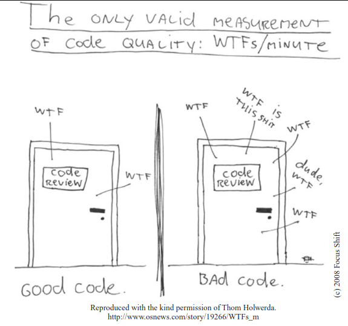

  

# مقدمه

کدام در، نماینده‌ی کد شماست؟ کدام در، نماینده‌ی تیم یا شرکت شماست؟
اصلاً چرا ما در این اتاق هستیم؟ آیا صرفاً در یک Code Review معمولی هستیم یا بعد از انتشار پروژه با حجم بزرگی از مشکلات وحشتناک مواجه شده‌ایم؟
آیا داریم در وضعیت بحرانی Debug می‌کنیم و کدی را بررسی می‌کنیم که فکر می‌کردیم درست کار می‌کند؟ آیا مشتری‌ها به‌سرعت در حال ترک ما هستند و مدیرها نفس‌مان را گرفته‌اند؟

وقتی شرایط سخت می‌شود، چطور می‌توان مطمئن بود که پشت درِ درست قرار گرفته‌ایم؟
پاسخ این است: Craftsmanship (استادی در کدنویسی).

یادگیری Craftsmanship دو بخش دارد: دانش و کار.
باید اصول، الگوها، روش‌ها و Heuristicهایی که یک کدنویس حرفه‌ای می‌داند، یاد بگیرید. ولی همین کافی نیست. باید آن دانش را در دست‌ها، چشم‌ها و دل خودتان حک کنید — با تمرین زیاد، کار سخت و تکرار مداوم.

من می‌توانم فیزیک دوچرخه‌سواری را به شما یاد بدهم. در واقع، ریاضیات کلاسیک آن چندان پیچیده نیست. گرانش، اصطکاک، مومنتوم زاویه‌ای، مرکز جرم و سایر مفاهیم را می‌توان با کمتر از یک صفحه فرمول توضیح داد.
با همین فرمول‌ها می‌توانم ثابت کنم که دوچرخه‌سواری عملی و ممکن است و همه‌ چیزهایی که برای آن نیاز دارید به شما بدهم...
ولی وقتی برای اولین بار سوار دوچرخه شوید، باز هم زمین خواهید خورد.

کدنویسی هم همین‌طور است. می‌توانیم تمام اصول «کد تمیز» را فهرست کنیم و بعد از شما انتظار داشته باشیم که فقط تمرین کنید (یعنی زمین بخورید).
اما آن وقت ما چه‌جور معلم‌هایی خواهیم بود؟ و شما چه‌جور شاگردی خواهید بود؟

نه. این کتاب این‌طوری نیست.

یاد گرفتن نوشتن Clean Code سخت است. تنها دانستن اصول و الگوها کافی نیست. باید برایش زحمت بکشید. باید تمرین کنید و شکست بخورید. باید دیگران را ببینید که تمرین می‌کنند و شکست می‌خورند. باید ببینید چطور در تصمیم‌گیری‌ها تردید می‌کنند، اشتباه می‌کنند و بهای تصمیماتشان را می‌پردازند.

آماده‌ی کار سخت باشید. این کتاب یک کتاب انگیزشی نیست که بشود در پرواز خواند و قبل از فرود تمام کرد.
این کتاب از شما کار می‌خواهد — و کار سخت.

چه کاری باید بکنید؟ شما باید کد بخوانید — خیلی کد — و درباره‌ی خوبی‌ها و بدی‌هایش فکر کنید. از شما خواسته می‌شود که با ما همراه شوید؛ ما ماژول‌ها را باز می‌کنیم، بررسی می‌کنیم، و دوباره کنار هم قرار می‌دهیم.
این کار زمان‌بر و چالش‌برانگیز است؛ اما ارزشش را دارد.
ساختار کتاب

این کتاب از سه بخش تشکیل شده است:

بخش اول شامل چند فصل ابتدایی است که به توضیح اصول، الگوها و روش‌های نوشتن Clean Code می‌پردازد. در این فصل‌ها حجم زیادی از کد خواهید دید و خواندنشان چالش‌برانگیز خواهد بود — اما شما را برای بخش دوم آماده می‌کند.
اگر بعد از بخش اول کتاب را زمین بگذارید، برایتان آرزوی موفقیت می‌کنیم!

بخش دوم سخت‌ترین قسمت کتاب است. این بخش شامل چند مطالعه‌ی موردی با پیچیدگی فزاینده است. در هر مورد، کدی که ایراد دارد را به کدی بهتر و تمیزتر تبدیل می‌کنیم.
جزئیات در این بخش بسیار زیاد است. باید بین متن و کد دائم جابجا شوید، کدها را تحلیل کنید، دلایل تصمیمات ما را بفهمید و تمام مراحل را دنبال کنید.
برای این بخش وقت بگذارید؛ چون چند روز طول خواهد کشید.

بخش سوم پاداش نهایی‌ست. یک فصل شامل لیستی از Heuristicها و Code Smellهایی که در حین مطالعه‌ی موردی جمع‌آوری کرده‌ایم. در حین تمیز کردن کدها، دلایل هر تغییری را ثبت کرده‌ایم و تلاش کرده‌ایم احساس‌ و منطق پشت تصمیماتمان را شفاف کنیم.
نتیجه، یک پایگاه دانشی است که طرز فکر ما هنگام نوشتن، خواندن و پاک‌سازی کد را توصیف می‌کند.
چطور از کتاب استفاده کنید

این دانش اگر فقط بخش سوم را بخوانید و بخش مطالعات موردی (بخش دوم) را نادیده بگیرید، چندان ارزشی نخواهد داشت.
در مطالعات موردی، تغییرات همراه با ارجاع‌هایی به Heuristicها علامت‌گذاری شده‌اند — این ارجاع‌ها به‌صورت [H22] هستند. با این کار می‌توانید دقیقاً ببینید که کجا و چرا آن Heuristic استفاده شده است.

در انتهای کتاب، یک جدول ارجاع نیز وجود دارد که شماره‌ی صفحه‌ی هر Heuristic را نشان می‌دهد؛ می‌توانید سریعاً موارد استفاده‌شان را پیدا کنید.

اگر فقط بخش اول و سوم را بخوانید، صرفاً یک کتاب انگیزشی دیگر درباره‌ی نوشتن کد خوب خواهید داشت.
اما اگر وقت بگذارید، مرحله به مرحله با ما جلو بروید، تصمیم‌ها را همراه ما تحلیل کنید، و سعی کنید مثل ما فکر کنید — آنگاه درک عمیق‌تری از اصول، الگوها و روش‌ها به دست خواهید آورد.

آن‌ها دیگر صرفاً «دانش نظری» نخواهند بود — بلکه در ناخودآگاهتان جا می‌گیرند، در دست‌ها و چشمانتان، و در قلبتان.
درست مانند دوچرخه‌ای که وقتی یاد گرفتید، تبدیل به بخشی از اراده‌تان می‌شود.
